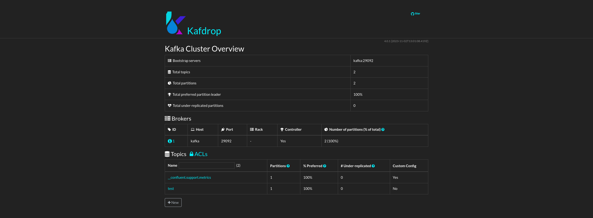
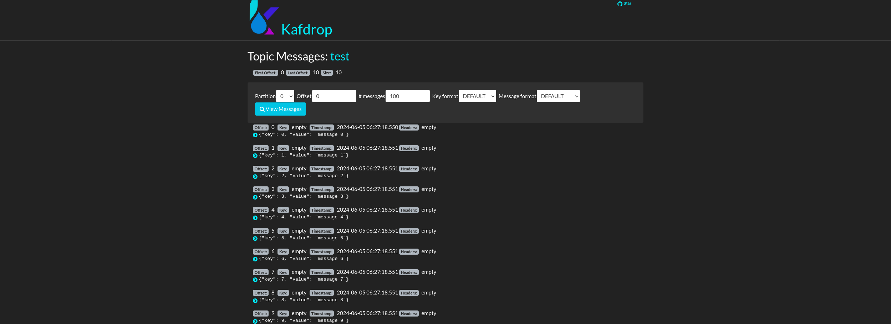
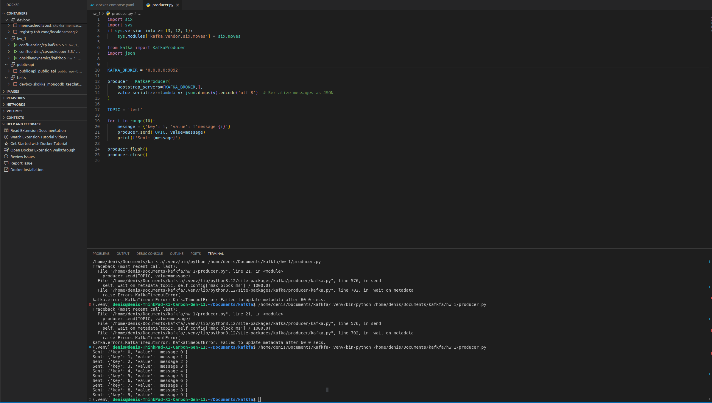

1. Docker Compsoe file  `docker-compose up -d --build`
```
version: '3.8'

services:
  zookeeper:
    image: confluentinc/cp-zookeeper:5.5.1
    restart: "no"
    ports:
      - "2181:2181"
    environment:
      ZOOKEEPER_CLIENT_PORT: 2181
      ZOOKEEPER_TICK_TIME: 2000

  kafka:
    image: confluentinc/cp-kafka:5.5.1
    restart: "no"
    ports:
      - "9092:9092"
    environment:
      KAFKA_BROKER_ID: 1
      KAFKA_ZOOKEEPER_CONNECT: zookeeper:2181
      KAFKA_LISTENERS: "INTERNAL://:29092,EXTERNAL://:9092"
      KAFKA_ADVERTISED_LISTENERS: "INTERNAL://kafka:29092,EXTERNAL://localhost:9092"
      KAFKA_LISTENER_SECURITY_PROTOCOL_MAP: "INTERNAL:PLAINTEXT,EXTERNAL:PLAINTEXT"
      KAFKA_INTER_BROKER_LISTENER_NAME: "INTERNAL"
      KAFKA_ZOOKEEPER_SESSION_TIMEOUT: "6000"
      KAFKA_RESTART_ATTEMPTS: "10"
      KAFKA_RESTART_DELAY: "5"
      KAFKA_AUTO_CREATE_TOPICS_ENABLE: "true"

  kafdrop:
    image: obsidiandynamics/kafdrop
    restart: "no"
    ports:
      - "9000:9000"
    environment:
      KAFKA_BROKERCONNECT: "kafka:29092"
    depends_on:
      - "kafka"
```

2. Python producer
```
import six
import sys
if sys.version_info >= (3, 12, 1):
    sys.modules['kafka.vendor.six.moves'] = six.moves

from kafka import KafkaProducer
import json


KAFKA_BROKER = '0.0.0.0:9092'

producer = KafkaProducer(
    bootstrap_servers=[KAFKA_BROKER,],
    value_serializer=lambda v: json.dumps(v).encode('utf-8')  # Serialize messages as JSON
)

TOPIC = 'test'

for i in range(10):
    message = {'key': i, 'value': f'message {i}'}
    producer.send(TOPIC, value=message)
    print(f'Sent: {message}')

producer.flush()
producer.close()
```

## Screenshots

1. kafka broker List



2. Messages



3. Producer
