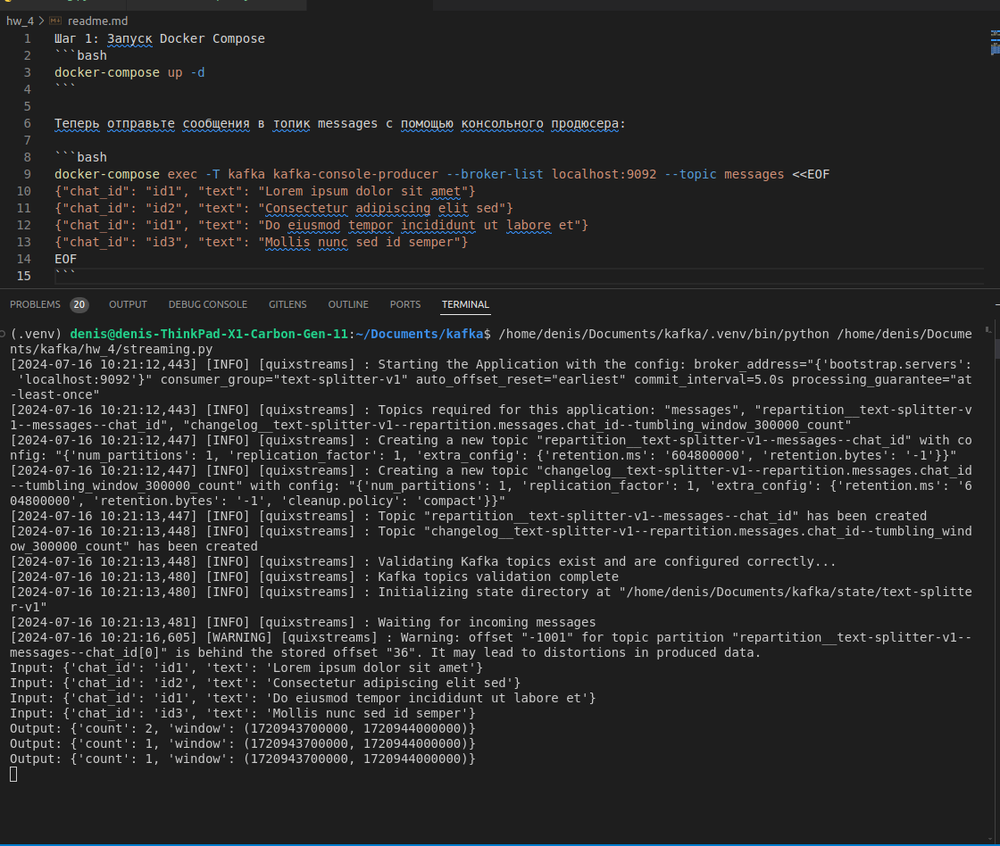

Шаг 1: Запуск Docker Compose
```bash
docker-compose up -d
```

Теперь отправьте сообщения в топик messages с помощью консольного продюсера:

```bash
docker-compose exec -T kafka kafka-console-producer --broker-list localhost:9092 --topic events <<EOF
{"chat_id": "id1", "text": "Lorem ipsum dolor sit amet"}
{"chat_id": "id2", "text": "Consectetur adipiscing elit sed"}
{"chat_id": "id1", "text": "Do eiusmod tempor incididunt ut labore et"}
{"chat_id": "id3", "text": "Mollis nunc sed id semper"}
EOF
```

Результат:
1. 