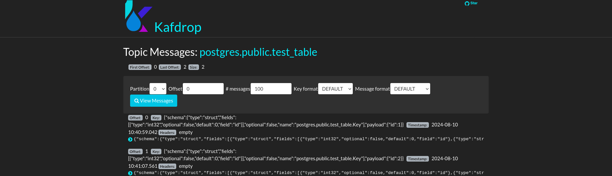
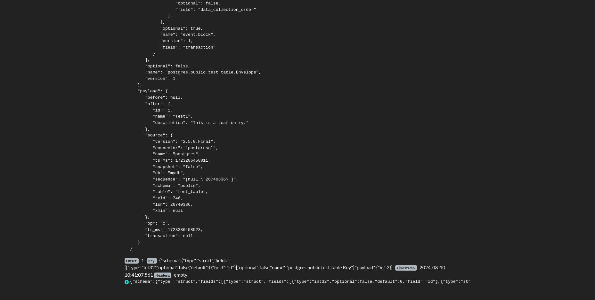

1. Запуск docker-compose

```bash
docker-compose up -d
```

2. Создание тестовой таблицы в PostgreSQL

Подключитесь к PostgreSQL и создайте тестовую таблицу:
```bash
docker exec -it <container_id> psql -U debezium -d mydb
```

Создайте таблицу:
```sql
CREATE TABLE test_table (
    id SERIAL PRIMARY KEY,
    name VARCHAR(255),
    description TEXT
);
```

3. Отправьте `config.json` конфигурацию на Kafka Connect REST API:
```bash
curl -X POST -H "Content-Type: application/json" --data @config.json http://localhost:8083/connectors
```

4. Добавление записей в таблицу
```sql
INSERT INTO test_table (name, description) VALUES ('Test1', 'This is a test entry.');
INSERT INTO test_table (name, description) VALUES ('Test2', 'This is another test entry.');
```

5. Проверка записи в Kafdrop
```bash
http://localhost:9000
```


Результат:

1. 

2. 